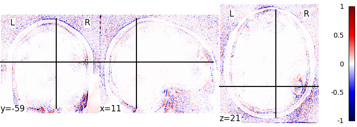

# Compare 3D nifti images in Python

## Installation

`pip install -r requirements.txt`

## Usage

`./imcomp.py image1.nii.gz image2.nii.gz im1im2diff`

Result example: 

## manymaths experiment with HCP pipelines

### Sanity checks

- Two consecutive executions of the pipeline with the same libmath give the same result
- Preloading of openlibm and openlibm wrapper give same results
- Regular glibc execution and glibc wrapper give same results
- `wrap/test.c` to be expanded